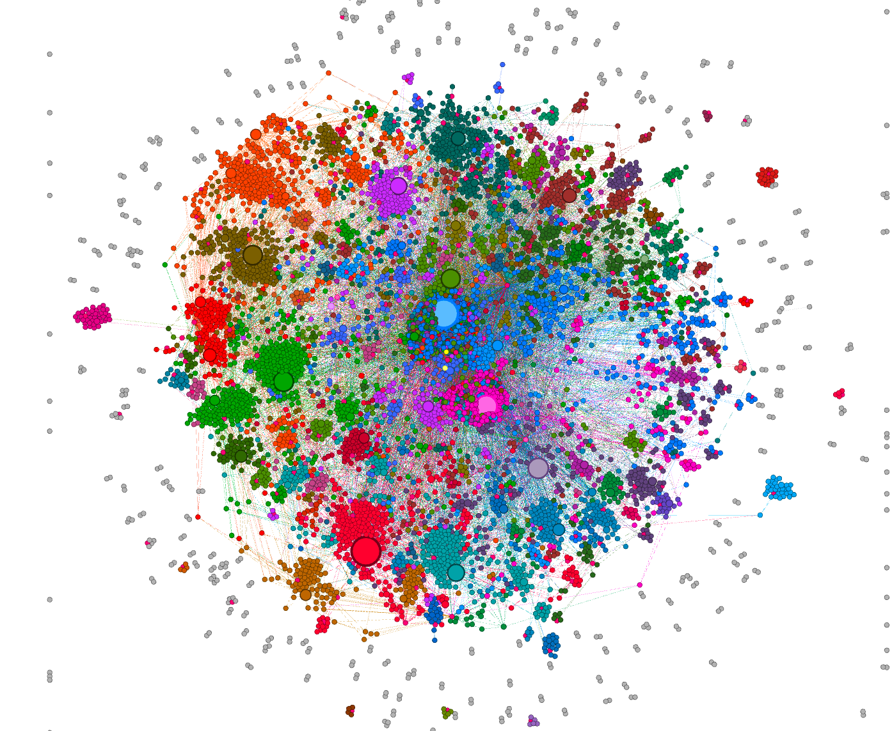
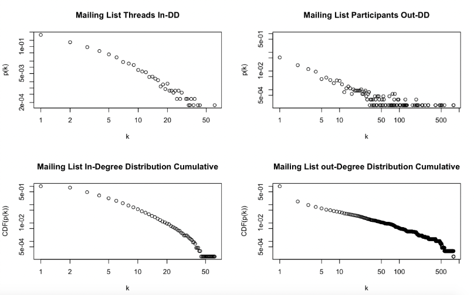

Some of open source projects and GitHub.com is the defacto standard for collaborative code development, it lacks a service for communication, allowing to discuss in-depth issues. Projects use traditional Email, mostly not even containing any HTML fragments. The structure is organized based on the size of the open source project. The Linux Mainline Kernel.org contains many sub lists for specific areas, like graphic drivers, network stacks or encryption. Smaller project like OpenWrt.org, the one we looked at, only contains one for development and one for meta questions, like organizational issues.

For this project, I was responsible for analysis of the network using igraph in R and Gephi for visualization. I converted the original network created using graphml to a Bi-Partite network of Participants(sender/ receiver of email) and Threads(Emails).  The analysis was focussed on most active participants (participants refer to developers or other contributors) who are involved in contributing to the Open Source Project and degree distributions. Also used Community detection in bipartite network to see which communities overlap with other communities and which communities are isolated.

#Degree Distributions
Below plot shows the degree distribution of indegree(threads) and out degree (participants) in the mailing list network. The out-degree distribution plot exhibits scale free and power law like distribution. There are few isolated nodes for both participants and threads. It exhibits power law property which may be a consequence of a robust self-organizing mechanism: where networks could expand continuously by the addition of new nodes and, new nodes attach preferentially to that are already well connected, i.e. rich nodes get richer becoming hubs.

