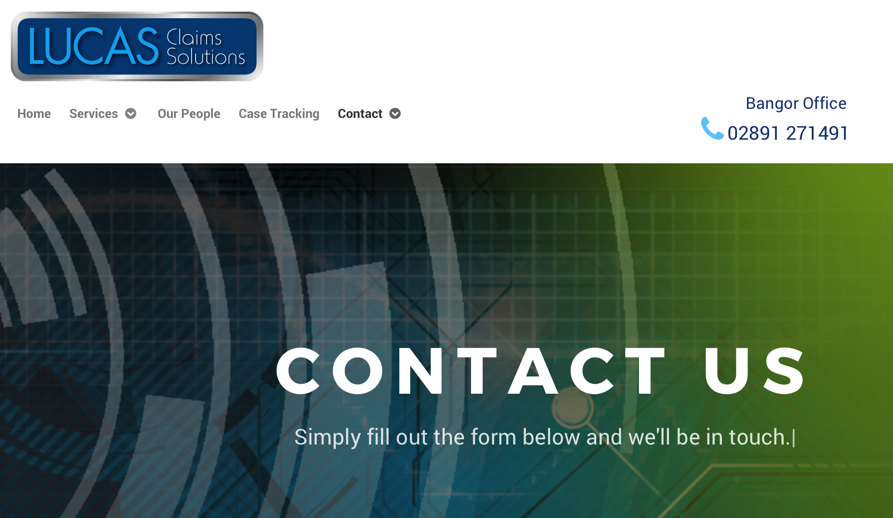

LuCAS is a web application that LUCAS provides legal administrative services for class action settlements and other claims administration, mass
tort, solicitation, legal noticing programs, and bankruptcy cases worldwide. It serves law firms, corporate legal departments, government agencies, and other legal professionals. 
 
My responsibilities in the project was to understand the business requirements, estimate the backlog and implement business logic and business objects using C# and Angular in agile process. I created Amazon Lambda compatible web API's, developed client-side Angular components and document management using Amazon S3 buckets, created C# Unit test cases using NSubstitute and writing specs for Angular components with Jasmine and Karma frameworks and created Integration tests and was involved in build and deployment of the backlogs. It was a wonderful experience to learn and work on new technologies which I hadn't worked before. In this project I gained experience on Asp.net Core, MongoDB and AWS and Angular 4.0 for front-end.
