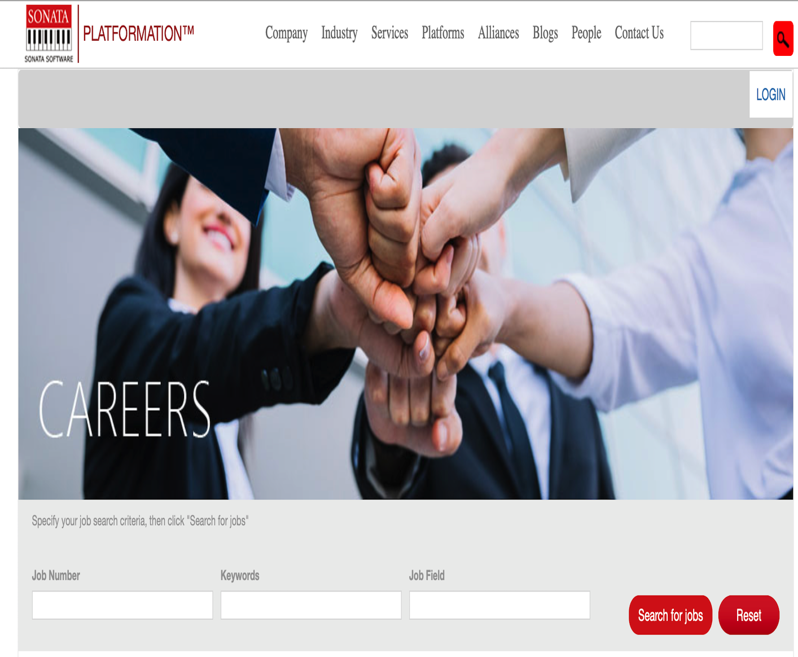

Fresher’s Recruitment Platform is Sonata Software’s Platformation initiative for hiring freshers engineering graduates through web portal.

I was responsible for the following activities in the project.
<ul>
<li>Worked on MSA Architecture for Web API service and created business logic for Candidate, Institute, Notification and HR Services</li>
<li>Worked on Uploading and retrieving documents from the Azure Blob storage</li>
<li>Worked on Web API service for sending and saving email notifications during each process of hiring</li>
<li>Worked as Team Lead and guided team members during the development and documentation of web portal</li>
<li>Interacting with Business Analyst and QA Team to ensure ease of end to end delivery</li>
<li>Ensured the delivery of build and integration of Web API services, and Portal on Azure</li>
</ul>

