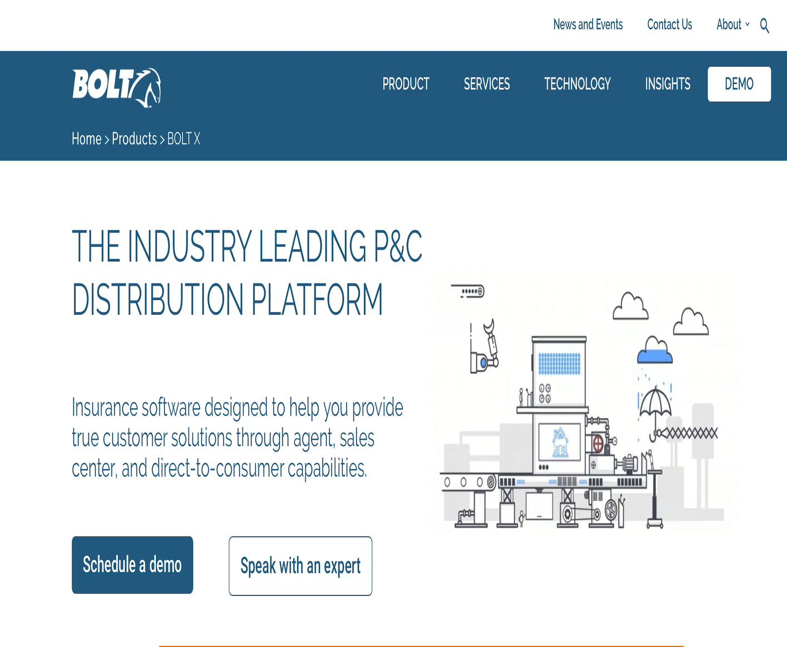

The Bolt Platform is a web portal that integrates process framework which spans the full range of activities that a carrier would need to present consumers with an optimized, Omni-channel experience. The platform features products from all major Insurance companies in USA and helps to compare various insurance plans that best suits individual needs.

BOLT was my first project in my work career. It was a nice experience working on a .Net web application to gain more knowledge about Software Development Life Cycle. I was interacting with the Business Analyst/Client and understood the new Carrier/Agent integration requirements. Implemented integration of new Agent/Carrier to the BOLT Platform using web services and screen scrapping technology. Individually delivered 10 screens with minimum defects and implemented integration of platform with google to fetch quotes for few carriers and display it on the web application.

